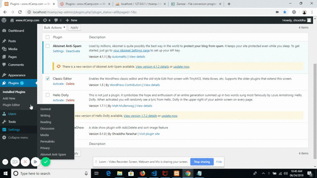

# wordpress-slideshow :customs:
A Wordpress slideshow plugin using that you can create multiple slideshow. it will allow the site admin to add,delete the slideshow images  using wordpress media uploader. site admin can sort or rearrange the  images of gallery also can remove complete gallery. it  provides the list of created gallery in visul editor toolbar in form of dropdown named Slideshow and using that you can add the gallery to the wordpress post and pages.
# Video Demo  :video_camera:

# Getting Started  :mountain_bicyclist:

These instructions will get you a copy of the project up and running on your local machine for development purposes.

# Prerequisites  :black_nib:

You need to have any WordPress theme activated on your WordPress project, and you should have authority to activate and deactivate the plugin and should have options to create or edit pages.

# Installation  :beginner:

Clone the plugin directory in the /wp-content/plugins/ directory, or install a zipped directory of this plugin through the WordPress plugins screen directly.Activate the plugin through the 'Plugins' screen in WordPress

# Useage Instruction  :beginner:

After activation of plugin use following instruction to use the plugin inyour wordpress site

* You will see Gallery menu in WordPress Dashboard. 
* on click of Gallery menu  you will see add image button
*  Click on **Add Image** button add a gallery name and create a nice  image gallery
*  Click on **Save image** button to save image gallery.
*   Click on **Remove Gallery** button to delete cmplete gallery.
*  images would be visible with right tick mark on left hand corner and on hover over that  you will get dash ( **-**) mark for    remove image
*  you can reorder gallery images, remove image if you want. and save gallary using save image button.
*  go to any wordpress page/post of your choice and use toolbar menu  **slideshow** to add gallery shortcode
*  you can add and remove multiple gallery at once

# Author  :pencil2:

    shraddha Parashar- WordPress Slideshow

# License  :ledger:

This project is licensed under the MIT License - see the LICENSE.md file for details

# Acknowledgments  :full_moon_with_face:

 _Inspiration:_  A rtCamp Plugin Challenge
 
